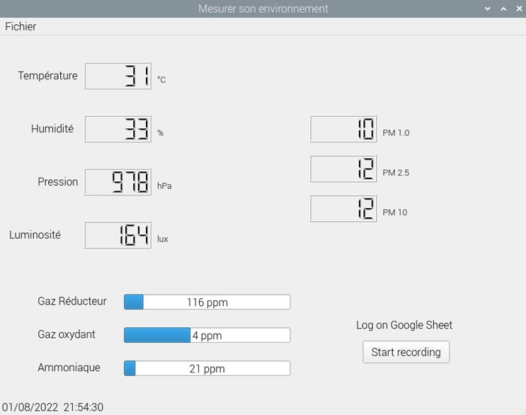

## Project with the enviro+ hat.

In this project I used a Raspberry Pi 4 board with an [enviro+](https://shop.pimoroni.com/products/enviro?variant=31155658457171) hat from Pimoroni and a pms5003 particle sensor.

This project was an opportunity to test the PyQt GUI toolkit and the Google sheet access from Python.

The GUI was designed with QtDesigner and PyQt version was 5.

*The GUI window is the following :*

The program use 3 timers (QTimer objects) :

- 3 minutes timer for logging in gsheet.
- 10 seconds timer for data acquisition and averaging.
- 1 second timer to dis^lay the time in the staus bar.

